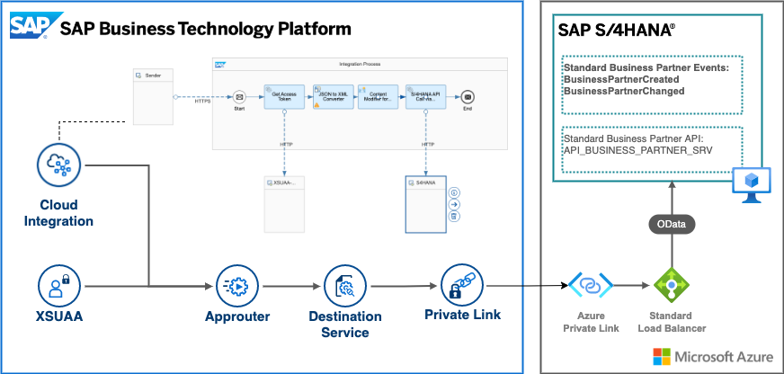

# SAP Private Link service with SAP Cloud Integration for building diverse integration scenarios

The SAP Cloud Integration capability of SAP Integration Suite enables enterprises to connect different systems and applications in hybrid and cloud landscapes, that are developed and maintained on different technology stacks. These stacks, usually follow different security standards and requirements. 

With the help of the SAP Private Link service, you can extend your hybrid integration scenarios to suit stricter security policies and communicate with your SAP S/4HANA on Microsoft Azure through private network connectivity. 

The main idea of this architecture is to use the Application Router as a proxy for the private connectivity between SAP S/4HANA and SAP Cloud Integration. The detailed configuration steps you can follow here.

